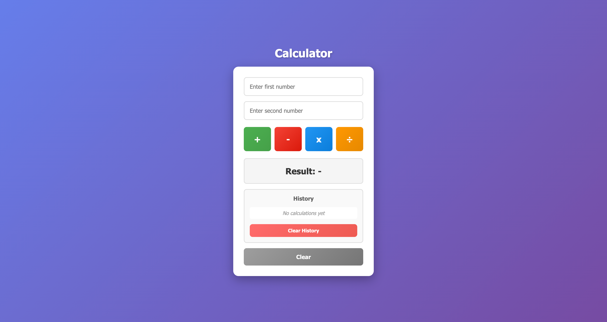
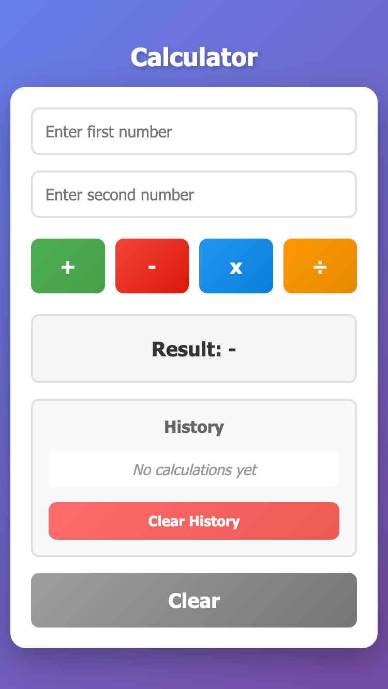

# Simple Calculator
A simple, clean, and responsive web calculator built with HTML, CSS, and JavaScript.

## 🚀 Features
- ✅ Basic arithmetic operations (+, -, ×, ÷)
- ✅ Input validation (invalid input & divide by zero)
- ✅ Responsive design (mobile, tablet, desktop)
- ✅ Clean and intuitive UI
- ✅ Keyboard support (Enter key)
- ✅ Error handling with visual feedback
- ✅ Clear button to reset calculator

## 🛠️ Technologies
- **HTML5** - Structure
- **CSS3** - Styling (Flexbox, Grid, Animations)
- **Vanilla JavaScript** - Logic (No frameworks!)

## 📖 How to Use
1. Enter two numbers in the input fields
2. Click one of the operation buttons (+, -, ×, ÷)
3. See the result displayed below
4. Click "Clear" to reset

**Keyboard Shortcut:**
-Press `Enter` to perform addition

## 🎨 Screenshots
### Desktop View

### Mobile View

## 🧪 Testing
All test cases covered:
- ✅ Basic operations (integers)
- ✅ Decimal numbers
- ✅ Negative numbers
- ✅ Edge cases (0, divide by zero)
- ✅ Invalid inputs
- ✅ Responsive design (320px - 1920px)

## 🚀 Live Demo
[View Live Calculator](https://jiiahhhh.github.io/calculator/)

## 💡 What I Learned
- DOM manipulation (getElementById, addEventListener)
- Event handling (click events, keyboard events)
- Input validation (parseFloat, isNaN)
- Error handling patterns
- Responsive design with CSS Grid & Flexbox
- Git workflow (meaningful commits)
- Code organization (helper functions, DRY principle)

## 🔮 Future Improvements
- [ ] Add more operations (√, x², %)
- [ ] Calculation history
- [ ] Memory functions (M+, M-, MR, MC)
- [ ] Theme toggle (dark/light mode)
- [ ] Scientific calculator mode

## 👨‍💻 Author
**Your Name**
- GitHub: [@Jiiahhhh](https://github.com/Jiiahhhh)

## 📝 License
This project is open source and available under the [MIT License](LICENSE).